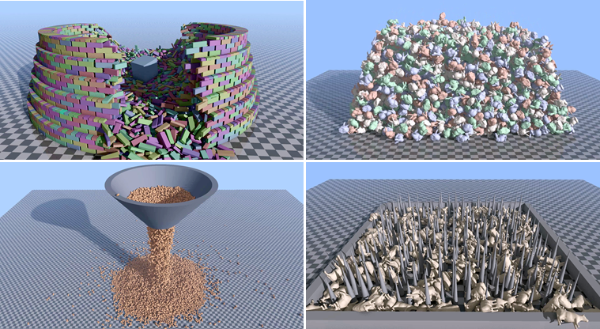

# Real-Time Collision Handling for Signed Distance Fields via Caching and Importance Sampling

Chris Giles and Sheldon Andrews. *Computer Graphics Forum* 45(7), Pacific Graphics 2026.

**[Project page](https://savant117.github.io/sdf-dcd-demo/)** · **[Live demo](https://savant117.github.io/sdf-dcd-demo/demo/)** · **[Paper (PDF)](docs/paper.pdf)**



This repository contains a minimal C++ implementation of the paper, written to be read alongside
it. SDF-SDF collision detection is treated as an optimization problem. For every pair of bodies
with overlapping bounding boxes, a handful of seed points are optimized towards points of deep
intersection. The seeds are the contact points of the previous time step (a temporal cache) and a
few stochastic samples drawn from precomputed high curvature points. The resulting sparse contact
manifold is handed to a small sequential impulse rigid body solver.

The demo runs natively and in the browser through WebAssembly and WebGL2. It includes:

- Algorithm 1 of the paper with the three optimizers it compares: Nelder–Mead, the ellipsoid method
  and stochastic gradient descent
- Controls for every parameter of the method: cached and random sample counts, temporal caching,
  curvature sampling, softmax smoothing, repulsion, tolerance and iteration limit
- Analytical SDFs (boxes, spheres, capsules, cylinders, cones, tori, spike plates, a spiky wheel),
  the BEND, TWIST and DISPLACE distortion operators, and voxel SDFs baked from meshes
- Scenes based on the paper's experiments: box and gear stacking, distorted falling boxes, a pile
  of chairs, the spiky wheel, cows on spikes and more
- OBJ import. The mesh is baked into a 100³ voxel SDF on the fly, with high curvature seeds.
- Visualization of the contact points (cached or new), the normals, the seed points and the
  search volumes, along with per step collision statistics
- Shadow mapping and screen space ambient occlusion with visibility bitmasks
  ([Therrien et al. 2023](https://arxiv.org/abs/2301.11376))

## Building

Clone the repository with its submodules ([SDL2](https://github.com/libsdl-org/SDL) and
[Dear ImGui](https://github.com/ocornut/imgui)):

```
git clone --recurse-submodules https://github.com/savant117/sdf-dcd-demo
cd sdf-dcd-demo
```

You need CMake 3.16 or newer and a C++17 compiler.

### Native

```
cmake -B build
cmake --build build --config Release
```

Then run `build/Release/sdf_dcd_demo.exe` (Visual Studio) or `build/sdf_dcd_demo` (single-config
generators). SDL2 is built from the submodule and linked statically. On Linux, SDL needs the
development packages of your windowing system, for example
`sudo apt install libx11-dev libxext-dev libgl-dev`.

Tested with MSVC on Windows and GCC on Linux. macOS should work but has not been tested.

### Web

Install [Emscripten](https://emscripten.org/docs/getting_started/downloads.html) (tested with
4.0.3) and [Ninja](https://ninja-build.org/), then:

```
emcmake cmake -B build-web -G Ninja
cmake --build build-web
```

The whole demo, including the assets, is packed into `build-web/index.html`. Serve that folder with
any static web server, for example `python -m http.server -d build-web`, and open
http://localhost:8000. Use `index.html?scene=N` to start in scene `N`.

## Controls

| Input | Action |
| --- | --- |
| Left drag | Move a body, or orbit the camera when starting on the background |
| Right drag | Orbit the camera |
| Middle drag | Pan |
| Wheel, pinch | Zoom |
| Space | Drop the selected shape |
| P / R | Pause / reset the scene |
| Drop an OBJ file on the window | Import it as a voxel SDF |

## Code overview

All code is in [`source/`](source). Section and equation numbers in the comments refer to the paper.

| File | Contents |
| --- | --- |
| [`collide.h`](source/collide.h), [`collide.cpp`](source/collide.cpp) | Algorithm 1 (`Manifold::update`): the search domain V (Sec. 3.1), the objective (Eqs. 1–3), contact data (Eq. 5), cache advection (Eq. 6), stochastic sampling (Sec. 3.5.2), duplicate removal and the temporal cache |
| [`optimize.cpp`](source/optimize.cpp) | Nelder–Mead, the deep cut ellipsoid method and stochastic gradient descent (Sec. 3.3) |
| [`shapes.h`](source/shapes.h), [`shapes.cpp`](source/shapes.cpp) | Analytical SDFs and composites, the distortion operators (Sec. 4.5), mass properties and high curvature seed points (Eq. 7) |
| [`voxel.cpp`](source/voxel.cpp) | Voxel SDFs baked from triangle meshes (Sec. 3.6) |
| [`body.h`](source/body.h) | Rigid bodies with a scaled SDF |
| [`solver.h`](source/solver.h), [`solver.cpp`](source/solver.cpp) | Sort and sweep broad phase and a velocity level sequential impulse solver with Baumgarte stabilization (applied with split impulses), as in the paper's CPU experiments (Sec. 4) |
| [`scenes.cpp`](source/scenes.cpp) | The demo scenes and the shape library |
| [`main.cpp`](source/main.cpp) | Window, UI and input |
| [`render.cpp`](source/render.cpp), [`mesh.cpp`](source/mesh.cpp), [`gl.h`](source/gl.h) | OpenGL 3.3 / WebGL2 renderer with shadow mapping and visibility bitmask ambient occlusion, meshes and OBJ loading |

## Parameters

The defaults are the values used throughout the paper (*Paper Defaults* in the UI resets them).
Models are normalized to roughly unit size, as in the paper.

| Parameter | Symbol | Default | Description |
| --- | --- | --- | --- |
| Cached Samples | n_cache | 4 | Points kept in the temporal cache of each pair (Sec. 3.5.1) |
| Random Samples | n_rand | 1 | New stochastic samples per pair and step (Sec. 3.5.2) |
| Softmax Epsilon | ε | 0.1 | Smoothing of the objective (Eq. 2). Zero gives the hardmax of Eq. 1 |
| Repulsion Alpha | α | 0.01 | Repulsion between the points of a manifold (Eq. 3) |
| Tolerance | τ | 0.01 | Optimizer termination tolerance, also the distance below which points are removed as duplicates (Alg. 1) |
| Max Iterations | | 50 | Iteration limit of the optimizers |
| Replacement | | 0.01 | Improvement of g a new sample needs to replace a cached point (not in the paper) |
| Contact Margin | | 0.02 | Skin around the bodies: contacts are created within it and keep it open (not in the paper) |
| Allowed Penetration | | 0.01 | Penetration of the skin left uncorrected, half the margin (not in the paper) |
| Time step | Δt | 1/60 s | Taken in 4 solver substeps, each with its own collision detection (not in the paper) |
| Voxel resolution | | 100³ | Grid resolution of mesh based SDFs |
| Curvature threshold | κ | 4 | Seed points are surface points with \|Δφ\| > κ (Eq. 7) |

## Implementation notes

Some details are not fully specified by the paper, and a few choices were made for the demo:

- **Search domain.** All three optimizers are restricted to the search domain V (Sec. 3.1).
  Nelder–Mead projects its trial points onto V. The ellipsoid method uses a feasibility cut through
  the violated face of V whenever its center leaves V.
- **Ellipsoid method warm start.** The paper warm starts the ellipsoid as in Lopez-Adeva et al.
  [LM24]. Here each point starts from an ellipsoid centered on the seed that encloses V. Cached
  points blend it with the final ellipsoid of the previous step.
- **Sorting.** The manifold is sorted by g (Alg. 1, line 28), with the repulsion of Eq. 3 evaluated
  against the final manifold. This prefers deep points that are far from the others.
- **Solver warm starting.** The contact impulses are stored with the cached points, so turning off
  the temporal cache (or setting n_cache to 0) also turns off warm starting of the contact solver.
- **Convex pairs.** An addition to Alg. 1: two convex shapes (boxes, spheres, capsules, cylinders
  and cones) intersect in a single convex region, so there are no other contact regions for the
  random samples to find. While every cached point of such a pair is a contact, its n_rand random
  samples are skipped, and only the samples that top the cache up are kept. This roughly halves
  the collision time of the box stack. Gradient descent stalls too easily to rely on the cache
  alone, so it keeps its random samples. The option can be turned off in the UI.
- **Contact margin.** The contact margin (0.02) is a skin around the bodies. Pairs whose bounding
  boxes are within the margin are tested. An optimized point is a contact when it is inside both
  bodies (Sec. 3.4), or when the gap between the closest points of A and B is below the margin. The
  solver keeps the skin open, so resting bodies stay a small gap apart (between half the margin and
  the margin).
- **Allowed penetration.** A contact always stops the bodies from approaching, but the penetration
  of the skin is only corrected (by Baumgarte stabilization) beyond the allowed penetration, half
  the margin by default. Contacts within it stay in the cache without being pushed apart, which
  reduces jitter.
- **Separation in the solver.** Inside both bodies the penetration is measured with φA + φB, the
  full overlap of locally flat surfaces. The depth d of Eq. 5 is only about half of it, since the
  optimizer converges where φA ≈ φB. Otherwise the separation is the gap between the closest
  points of A and B, found with a Newton step (φ/|∇φ|²) so that distorted fields are handled. The
  contact normal is the one of Eq. 5, or the direction of the gap when x* is outside both bodies.
- **Coherent normals.** The optimizer converges where φA ≈ φB, so either field can be the more
  deeply penetrating one of Eq. 5. Where the surfaces face the same way, for example near the axis
  of a thin spike inside another body, the two normals are opposite, and the contact would push
  the bodies back and forth from step to step. Cached points keep whichever of the two normals is
  closer to their previous one instead, and the gap direction only replaces it if it does not
  reverse it.
- **Split impulses.** The Baumgarte correction is solved for pseudo velocities, which move the
  bodies within a substep and are then discarded. Added to the velocities, the correction of
  contacts that cannot all be satisfied at once, such as a spike wedged between the legs of a cow,
  pumps energy into the bodies and makes them jump.
- **Cache stability.** Two details keep the cache from wandering on contacts where many points
  are about equally deep, such as the faces of stacked gears. A new sample has to improve on g by a
  threshold (0.01) to replace a cached point. And Nelder–Mead refines a cached point with a simplex
  that covers how far the point was advected (at least 5τ), instead of 10% of V, since the point
  only has to follow the bodies.
- **DISPLACE operator.** Sec. 4.5 writes the operator as φ(x) + sin(kx) sin(ky) sin(kz). Here k
  is used as the amplitude, φ(x) + k sin(7x) sin(7y) sin(7z), which matches the range of k in
  Table 5 (the demo uses k = 0.1).
- **TWIST operator.** The matrix of Sec. 4.5 is used as written. It also permutes the axes, so the
  base box of the twisted plank has its y and z extents swapped, which gives it the same dimensions
  as the other planks.
- **Voxel SDFs.** Meshes are normalized to a unit cube and sampled on a 100³ grid, padded by 3
  cells. The sign comes from the winding number along grid lines, which tolerates meshes with
  small holes and overlapping parts. The gradient is baked next to the distance, and both are
  interpolated trilinearly.
- **CPU only.** Everything runs single threaded on the CPU, as in the paper's CPU experiments. The
  timings of Table 1 were measured with a GPU implementation, so they are not directly comparable.
- **Scene sizes.** The demo scenes are smaller than the paper's experiments so that they run in
  real time in a browser.

## Assets

- `assets/bunny.obj`: watertight version of the Stanford Bunny (Stanford 3D Scanning Repository),
  converted from the [OpenGP](https://github.com/OpenGP/OpenGP) data set
- `assets/gear.obj`: 20 tooth gear
- `assets/cow.obj`, `assets/chair.obj`: cow and chair models used in the paper's experiments

## Citation

```bibtex
@article{giles2026sdf,
  title   = {Real-Time Collision Handling for Signed Distance Fields via
             Caching and Importance Sampling},
  author  = {Giles, Chris and Andrews, Sheldon},
  journal = {Computer Graphics Forum},
  volume  = {45},
  number  = {7},
  year    = {2026},
  note    = {Pacific Graphics 2026}
}
```

## License

The code is released under the [MIT License](LICENSE). The paper is published open access under
the Creative Commons Attribution License.
